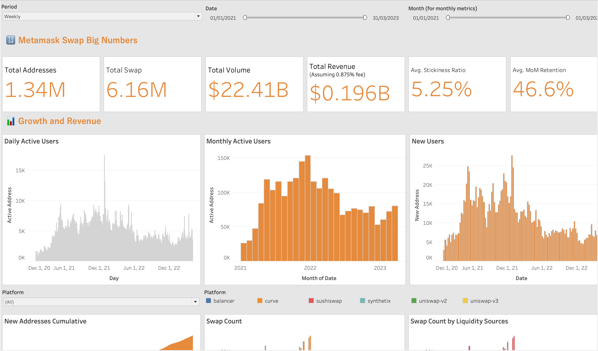

# Meta Mask Swap Analysis
  
## Introduction 🦊
MetaMask is a popular browser extension and mobile app that serves as a blockchain wallet and gateway to the decentralized web. With its user-friendly interface, MetaMask enables users to manage their digital assets, interact with decentralized applications (dApps), and perform token swaps seamlessly.

As of 2023, MetaMask has over 21 million monthly active users, showcasing its widespread adoption in the blockchain ecosystem. The platform's in-built swapping feature, MetaMask Swap, offers competitive prices and broad token support, making it a go-to choice for many users.

## Objective 🎯

This dashboard aims to provide insights into MetaMask Swap's performance and swap user engagement, shedding light on its role in shaping the DeFi landscape.

Additionally, this project serves to demonstrate my expertise in DeFi data analytics, as well as my proficiency in Python, advanced SQL, Tableau, and GitHub for on-chain data manipulation. Explore the project repository here.

You can access the dashboard [here!](https://public.tableau.com/app/profile/rodolfo/viz/MetamaskSwapAnalysis/MetamaskSwapAnalysis?publish=yes)

